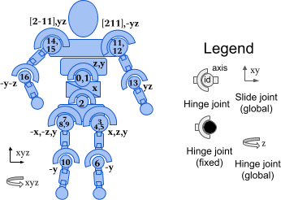
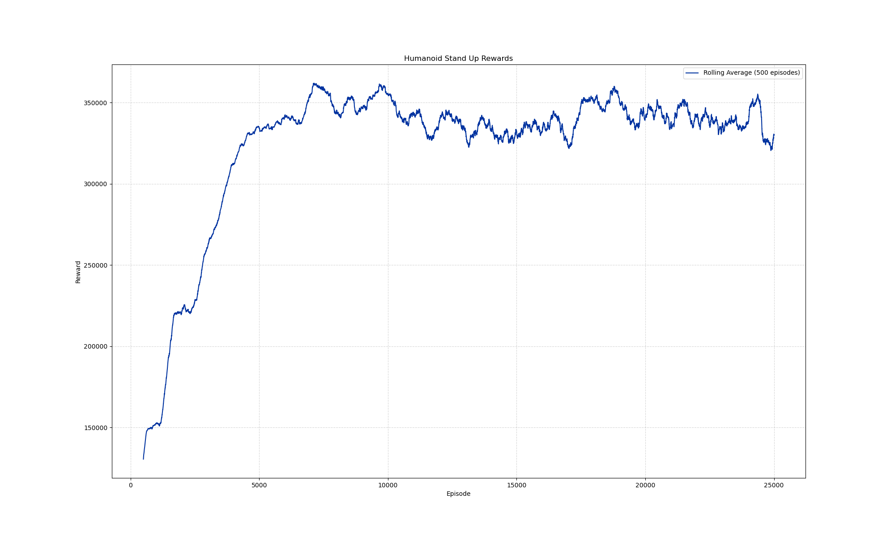

# SACMujoco_HumanoidStandup-v5

<p align="center">
 
  

</p>

---

## Overview
This project implements the Soft Actor Critic deep reinforcement learning algorithm from [StableBaselines3](https://stable-baselines3.readthedocs.io/en/master/) on the `HumanoidStandup-v5` environment from Mujoco via a Gymnasium wrapper. The full details of the environment can be found on the [Gymnasium](https://gymnasium.farama.org/environments/mujoco/humanoid/) website.

## Goals
- Successfully run Soft Actor Critic from StableBaselines3 on the Mujoco environment.
- Train the model on an adequate number of timesteps.
- Tune hyperparameters to optimize rewards during training.
- Properly test the trained model.
- Visualize training progress and results.


## System Requirements

These instructions assume you are using **Ubuntu 20.04 LTS**.

- **OS:** Linux-5.15.167.4-microsoft-standard-WSL2-x86_64-with-glibc2.39
- **Python:** 3.9.21
- **Stable-Baselines3:** 2.4.0
- **PyTorch:** 2.5.1+cu124 (GPU Enabled)
- **Numpy:** 1.26.4
- **Cloudpickle:** 3.1.0
- **Gymnasium:** 1.0.0

## Installation Guide

### 1. Update System Packages
Ensure your system is up to date before installing dependencies:
```bash
sudo apt update && sudo apt upgrade -y
```

### 2. Install Required System Dependencies
Install Python 3.9 and other essential packages:
```bash
sudo apt install -y python3.9 python3.9-venv python3.9-dev python3-pip git cmake build-essential libopenmpi-dev libomp-dev
```

### 3. Set Python 3.9 as Default (Optional)
If Python 3.9 is not the default version, configure it:
```bash
sudo update-alternatives --install /usr/bin/python3 python3 /usr/bin/python3.9 1
sudo update-alternatives --config python3  # Select Python 3.9 if prompted
```

### 4. Create and Activate a Virtual Environment
It is recommended to install packages inside a virtual environment:
```bash
python3 -m venv rl_env
source rl_env/bin/activate
```

### 5. Upgrade `pip`, `setuptools`, and `wheel`
```bash
pip install --upgrade pip setuptools wheel
```

### 6. Install PyTorch with CUDA Support
Install PyTorch with CUDA 12.4 for GPU acceleration:
```bash
pip install torch torchvision torchaudio --index-url https://download.pytorch.org/whl/cu124
```

### 7. Install Stable-Baselines3
```bash
pip install stable-baselines3==2.4.0
```

### 8. Install Additional Dependencies
```bash
pip install gymnasium==1.0.0 numpy==1.26.4 cloudpickle==3.1.0
```

---

## Notes

- Ensure that your system supports **CUDA 12.4** for GPU acceleration.
- If running inside **WSL2**, make sure **NVIDIA drivers** are correctly installed.

---

## Results
After training on 25 million timesteps (25,000 episodes), the model was able to successfully stand and remain in a standing position for the remainder of the episode.

<p align="center">
 

</p>

The tranining progress showed rapid improvement in the early episodes and became relatively stable after the first 5,000 episodes
<p align="center">
 

</p>

---

## License

This project is released under the **MIT License**. See [LICENSE](LICENSE) for details.

---

## Acknowledgments

- This implementation builds on **Stable-Baselines3**.
- The environment is based on the work of Tassa, Erez, and Todorov, introduced in ["Synthesis and stabilization of complex behaviors through online trajectory optimization"](https://ieeexplore.ieee.org/document/6386025).
